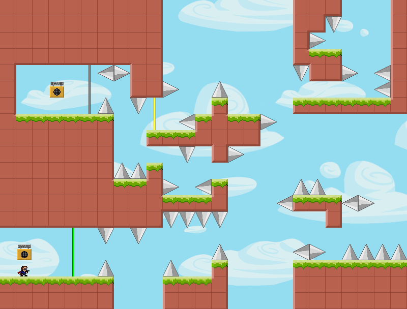
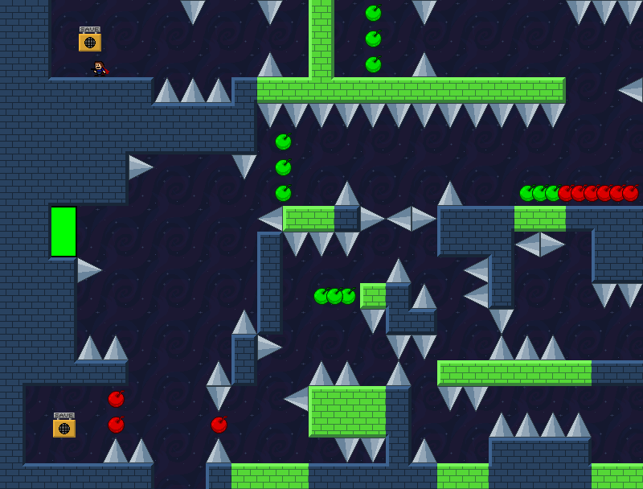

# I Wanna Super Ability
An "I Wanna" fangame.
## Description
The Kid never stopped its exploration. In an experience, he acquired a super ability by accident. You need to help it use its ability to get through more levels.

Game Name: I Wanna Super Ability  
Type: Trap, Adventure, Gimmick  
Length: Short  
Difficulty: Average
Controls:  
* `Shift` - Jump | Accept
* `← →` - Run
* `Z` - Shoot
* `R` - Retry
* `P` - Pause
* `Ctrl` + `M` - Toggle mute
* `X` - Toggle ability (after acquiring ability)
* `F2` - Restart game
* `F4` - Toggle full screen
* `Esc` - Exit game

Game Engine: GameMaker Studio 2.3.x  
I Wanna Framework: [IWBT GMS2 Engine YoYoYo Edition](https://delicious-fruit.com/ratings/game_details.php?id=18583) - Delicious Fruit
## Preview

## Download
* Repository Release
* [I Wanna Super Ability](https://mcube-12139.lanzoui.com/izEc9s0rscf) - MediaFire
## Credits
* [逍遥散人](https://space.bilibili.com/168598)  
  A bilibilier. This game is inspired by him.
* [盲人张卫2019](https://space.bilibili.com/471676923)  
  A bilibilier.The author of 《听我说-洛天依》.
* Myself.
* And so on.